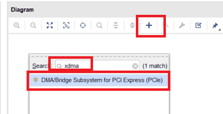
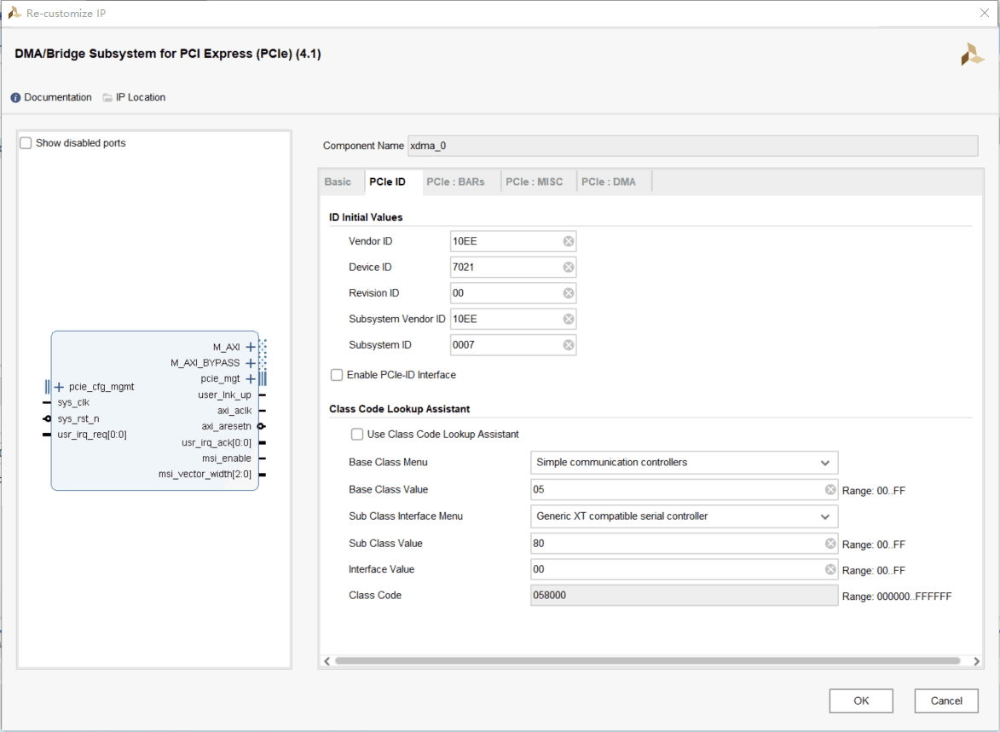
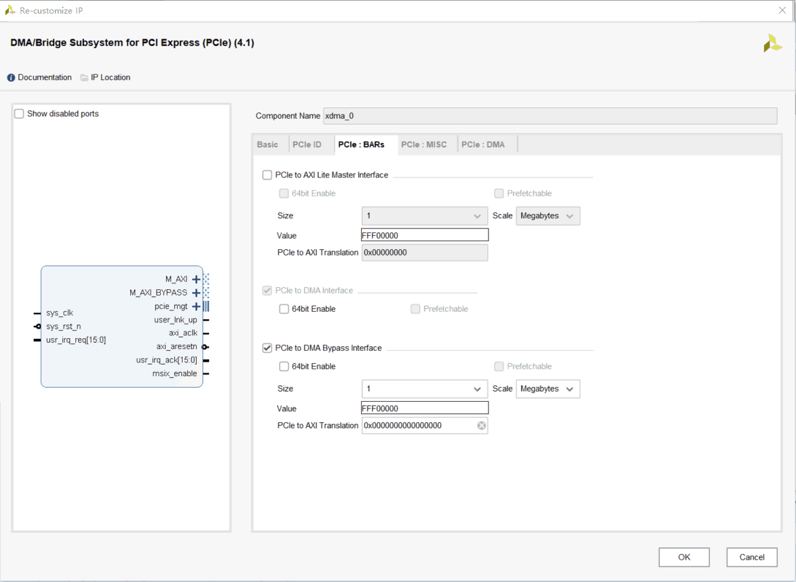
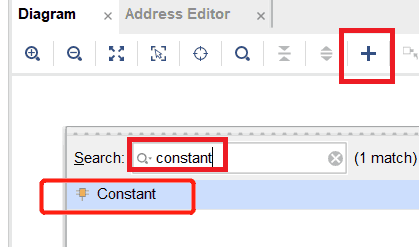
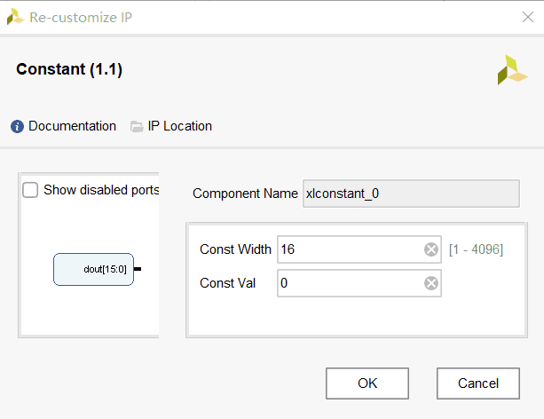
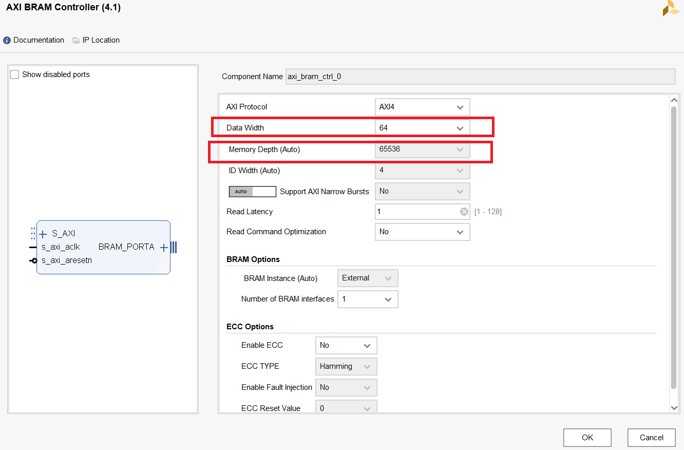
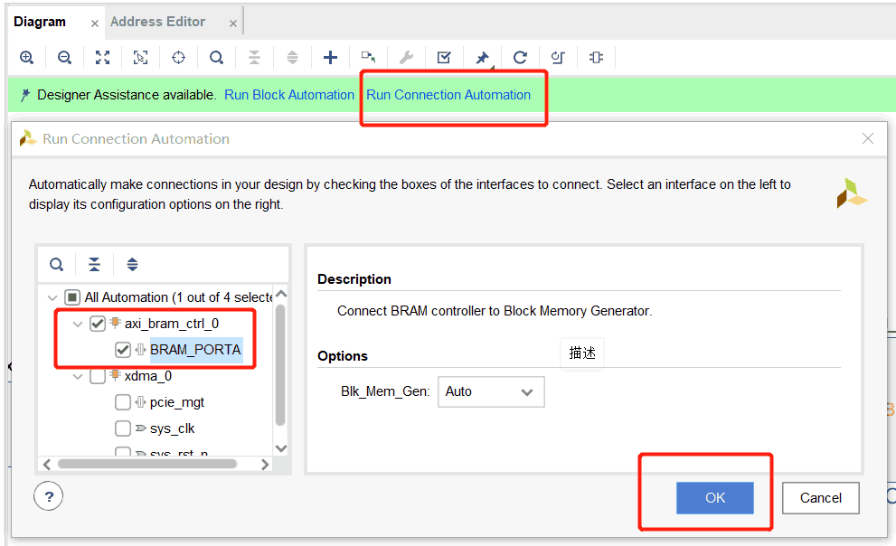
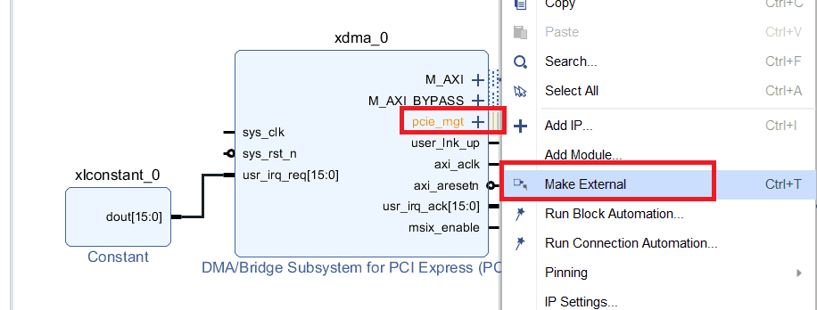

# 基于 blockdesign 的 PCIe BRAM 读写——Vivado 工程搭建

该例程对应的 Vivado 工程在 [netfpga_pcie_x1_xdma_bram_blockdesign](../netfpga_pcie_x1_xdma_bram_blockdesign) 中

该例程的结构框图如**图1** 。其中包括：

- 一个用 blockdesign 例化的 **PCIe-XDMA** IP核；
- 一个用 blockdesign 例化的 **AXI-BRAM** IP核；
- 用 blockdesign 将以上二者连接起来。整体而言实现了一个 PCIe 内存设备。
- 在 Host-PC 上编写 C 语言程序去读写它。

```
|------------|            |---------------------------------------------------------------|
|            |            |                                                               |
|            |            |    |---------------|                  |-------------------|   |
|            |            |    |               |                  |                   |   |
|   run      |    PCIe    |    |   PCIe-XDMA   |       AXI4       |   AXI-BRAM        |   |
|  C/C++     |<---------->|<-->|    IP core    |<---------------->|   (AXI-slave)     |   |
|  software  |            |    |               |Master       Slave|                   |   |
|            |            |    |  (AXI-master) | Port        Port |                   |   |
|            |            |    |---------------|                  |-------------------|   |
|            |            |                                                               |
|------------|            |---------------------------------------------------------------|
  Host-PC                                                      FPGA
                 图1 : PCIe-XDMA + AXI-BRMA 实现 PCIe 内存设备
```

　

该 blockdesign 搭建好后如下图：


这里我们使用  [NetFPGA-sume](https://digilent.com/reference/programmable-logic/netfpga-sume/start) 开发板举例。如果你用的是其它开发板，则开发流程类似，有少数步骤会不太一样。

　

## 建立 Vivado 工程

1. 打开 Vivado ，点 File → Project → New 建立工程
2. 在 Project Name 一页指定工程名称和位置
3. 在 Project 一页选择 RTL Project ，并勾选 Do not specify sources at this time.
4. 在 Default Part 一页选择 FPGA 型号。对于 [NetFPGA-sume](https://digilent.com/reference/programmable-logic/netfpga-sume/start) ，选择 **xc7vx690tffg1761-3**
5. 在下一页点 Finish ，完成工程建立

　

## 搭建 blockdesign

#### 建立 blockdesign

在左侧 Flow Navigator → IP Integrator 中点 Create Block Design ，然后指定该 block design 的名称，比如叫 xdma_bram 。然后点 OK 。

#### 添加并配置 PCIe-XDMA IP

在 Diagram 中点上方的 "+" (Add IP) ，输入 xdma ，然后双击 "DMA/Bridge Subsystem for PCIe"，如下图 。



然后就可以看到 Diagram 中出现了一个叫 xdma_0 的 IP 。双击这个 xdma_0 ，配置这个 IP 的参数，该 IP 的配置一共有5页。其中第一页最重要，如下图，你可以指定 PCIe 和 AXI 接口的相关信息。其中大多数选项与下图保持一致即可，但有一些选项你可以根据需要去修改：

- Lane Width 可以自由指定，因为 NetFPGA 的 PCIe 为 x8，我们可以取 x1, x4, x8 。本例中取 x1 。
- Maximum Link Speed 代表的是 PCIe 的速率，可以自由指定，2.5 GT/s 代表 PCIe Gen1， 5.0 GT/s 代表 PCIe Gen2，8.0 GT/s 代表 PCIe Gen3 。本例中取 5.0 GT/s
- Reference Clock Frequency 是指 PCIe 参考时钟的频率，由于 NetFPGA 使用的是来自 PCIe 插口的，由电脑主板提供的 PCIe 参考时钟，而 PCIe 规定该时钟频率为 100MHz 。因此这里取 100MHz 。
- AXI Data Width 是 AXI 总线中数据总线的宽度，也即一个周期最多可以读/写的比特数量。可以自由指定，但要和 AXI slave 保持一致。本例中取 64 bit。
- AXI Clock Frequency 是 AXI 总线的时钟频率，可以自由指定，只要 AXI slave 能工作在这个频率下就行。本例中取 62.5 MHz 。


**后4页配置务必保证和下图保持一致**，否则软件端的驱动程序可能不识别。配置好后，点OK。






　

#### 用 Constant IP 把 XDMA 的中断输入设为 0

xdma IP 添加好后，我们可以看到它的左边有一个 usr_irq_req[15:0] 信号，它是用来向主机发送中断的。由于我们暂时用不着中断，需要让该信号**恒定设置为0** 。

为此，我们在 Diagram 中点上方的 "+" (Add IP) ，输入 constant ，然后双击 "Constant"，如下图 。



然后我们可以看到出现了一个叫 xlconstant_0 的 IP，该 IP 非常简单——输出一个恒定值，我们双击该 IP ，设置 Const Width = 16 ，Const Val = 0 ，然后点 OK ，如下图。



然后把 xlconstant_0 的输出 (dout) 连接到 xdma_0 的 user_irq_req[15:0] 上，如下图。


　

#### 添加并配置 AXI-BRAM IP

我们在 Diagram 中点上方的 "+" (Add IP) ，输入 bram ，然后双击 "AXI BRAM Controller"，如下图 。


然后我们可以看到出现了一个叫 axi_bram_ctrl_0 的 IP，该 IP 的功能是充当 AXI master 和 “裸BRAM” 之间的桥梁，可以理解为进行一个协议转换——接收 AXI 总线的命令，把它转化为对 "裸BRAM" 的读写。

双击 axi_bram_ctrl_0 进行配置，如下图。其中大多数配置与下图相同即可，而我们可以自由配置的选项有：

- Data Width : 是 AXI 总线中数据总线的宽度，也即一个周期最多可以读/写的比特数量。可以自由指定，但要和 AXI master 保持一致。由于刚才我们在 xdma_0 中把 AXI Data Width 设为 64 bit ，因此这里也取 64 bit。
- Memory Depth : 存储器深度，决定了 BRAM 的容量。这里我们取 65536 ，则 BRAM 容量 = Memory Depth * Data Width = 65536 * 64 bits = 4M bits = 512 K Bytes.



然后我们把 xdma_0 的 AXI master 接口和  axi_bram_ctrl_0 的 AXI slave 接口连起来，同时把 AXI 所需的时钟和复位也连起来，如下图：


　

现在我们发现 AXI BRAM controller 右侧的 BRAM_PORTA 还空着，它需要连接一个 "裸BRAM" 。 "裸BRAM" 是一个名为 Block Memory Generator 的 IP ，你可以手动添加，但另一个简便的添加方法是点击上方的 **Run Connection Automation** ，这是 Vivado 提供的一个智能添加功能，比如它发现你添加了 AXI BRAM controller ，那么它猜测你下一步大概率想添加一个 "裸BRAM" 连上去，那么它就会自动帮你完成这个工作。

我们点击  **Run Connection Automation**  ，然后勾选选择 axi_bram_ctrl_0 → BRAM_PORTA ，然后点 OK 即可。如下图。



然后你会看到它帮你添加了一个 "裸BRAM" (Block Memory Generator) ，并连接到了 AXI BRAM controller 右侧的 BRAM_PORTA 上。如下图。


> :point_right: **Run Connection Automation** 只是一个智能补全工具，并不是万能的，有时候它并不能自动连接出我们想要的功能，甚至可能出现一些明显的错误（比如把不同时钟驱动的 AXI master 接口和 AXI slave 连接到一起。因此进行 **Run Connection Automation** 后记得检查。

　

#### 把 PCIe 相关的信号引出到外界

最后，我们看到这个设计中还有一些信号还没有连接。我们需要把其中的一部分信号引出到 blockdesign 的外部，其中：

- xdma_0 左侧的 `sys_clk` 、`sys_rst_n` 是 PCIe 的驱动时钟和复位，需要引出到 blockdesign 的外部，并在工程顶层上约束到 FPGA 的引脚上。
- xdma_0 右侧的 `pcie_mgt` 接口是 PCIe 的信号（我们可以展开它，发现它包含 TX 差分对和 RX 差分对）。需要引出到 blockdesign 的外部，并在工程顶层上约束到 FPGA 的引脚上。
- xdma_0 右侧的 `user_lnk_up` 信号指示 PCIe 连接是否建立。我们可以把它连接到开发板的一颗LED上，用来展示状态。

我们逐个右键这些信号，点击 **Make External** ，把它们引出到 blockdesign 的外部。



　

最后效果如下图。


　

#### 分配 AXI 地址映射

在 blockdesign 中，**只要有 AXI master 和 AXI slave 对接的情况，就需要进行地址分配** 。因为一个 AXI master 可能对应多个 AXI slave ，我们需要分配这些 AXI slave 在该 AXI master 中对应的地址 ——即使只有一个 AXI slave。

我们切换到 **Diagram** 旁边的 **Address Editor** ，发现目前 AXI master (也即xdma_0) 有一个 AXI slave (也即 axi_bram_ctrl_0) 没有分配地址。我们右键它，点击 "Assign Address" ，然后它会自动分配一个地址。

在这里，我们为了方便，把 Offset Address 设为 0x0000000000000000 。换句话说， 当 xdma_0 通过 AXI 总线对 0x0 这个地址进行读写时，读写的就是 axi_bram_ctrl_0 的起始位置。

另外，注意到因为我们之前分析过 axi_bram_ctrl_0 的尺寸设置是 512KB ，因此这里我们发现 axi_bram_ctrl_0 刚好占用了 512K 的 Range，其最高位地址为 0x7FFFF 。


　

#### blockdesign 验证

我们切换回 Diagram ，然后点击上方的 "Validate Design" ，软件会帮我们检查该 blockdesign 中是否有错误。它只能检查出一些低级错误（比如 AXI 总线两侧的位宽不匹配），而功能性的正确性还需开发者自己保证。


#### 生成 blockdesign 的 HDL Wrapper

blockdesign 开发方法本质上还是基于 HDL 语言（例如 Verilog HDL）的，例如我们刚刚搭好的这个 blockdesign 实际上就是 Vivado 帮我们封装好的一个大型的 Verilog 模块 (module) ，我们需要把它生成为实际的 Verilog module ，然后才能调用它实现最终的部署。

> :point_right: blockdesign 的方便之处在于帮我们简化了 IP 核之间手动的连线的步骤，例如刚刚我们搭建的系统，如果手动编写 Verilog ，就需要几十行代码来手动连接大量的 AXI 总线信号。

我们右键 Sources 中的 block design （也就是最开始被我们命名为 xdma_bram 的这个 Blockdesign），点击 "Generate HDL Wrapper" ，如下图。


　

然后它就会生成一个名为 xdma_bram_wrapper 的 Verilog 源文件。双击这个文件可以看到它的代码，我们发现它的模块输入输出接口就是我们之前引出到 blockdesign 的外部的那些信号（也即 PCIe 时钟、复位、信号），如下：

```verilog
// block design 生成的 HDL wrapper 的 输入输出接口
module xdma_bram_wrapper
   (pcie_mgt_0_rxn,
    pcie_mgt_0_rxp,
    pcie_mgt_0_txn,
    pcie_mgt_0_txp,
    sys_clk_0,
    sys_rst_n_0,
    user_lnk_up_0);
  input [0:0]pcie_mgt_0_rxn;
  input [0:0]pcie_mgt_0_rxp;
  output [0:0]pcie_mgt_0_txn;
  output [0:0]pcie_mgt_0_txp;
  input sys_clk_0;
  input sys_rst_n_0;
  output user_lnk_up_0;
```

注意到在这里，PCIe 的参考驱动时钟 `sys_clk_0` 是单端的，而 FPGA 引脚上收到的的 PCIe 参考时钟实际上是差分的。因此这里还需要一个单端转差分的 clock buffer 。另外，还需要对复位信号 `sys_rst_n_0` 进行 IO buffer 。这一步将在以下 Verilog 顶层模块中实现。

　

　

## 编写 FPGA 顶层的 Verilog 模块

下一步我们要编写一个 Verilog 模块，来调用这个 blockdesign 。同时实现 clock-buffer 和 IO-buffer 。

给工程添加一个 Verilog 文件，名为 `fpga_top.v` ，然后在其中编写代码如下。注意到：

- `fpga_top.v` 调用了我们在上一步生成的 block design 的 HDL wrapper 。
- `fpga_top.v` 调用了 `IBUFDS_GTE2` 和 `IBUF` ，分别是 clock-buffer 和 IO-buffer ，它们是 Xilinx 提供的**原语** (**primitive**) ，对应着 Xilinx FPGA 种的资源。在 Vivado 的 Verilog 编程中不需要引入任何文件就能调用，但不能移植到其它 FPGA 厂商的 Verilog 工程中。

```verilog
module fpga_top (
    output wire       o_led0,
    input  wire       i_pcie_rstn,
    input  wire       i_pcie_refclkp, i_pcie_refclkn,
    input  wire [0:0] i_pcie_rxp, i_pcie_rxn,
    output wire [0:0] o_pcie_txp, o_pcie_txn
);
    
wire  pcie_rstn;
wire  pcie_refclk;

// Ref clock input buffer ----------------------------------------------
IBUFDS_GTE2 refclk_ibuf (
    .CEB             ( 1'b0              ),
    .I               ( i_pcie_refclkp    ),
    .IB              ( i_pcie_refclkn    ),
    .O               ( pcie_refclk       ),
    .ODIV2           (                   )
);

// Reset input buffer ----------------------------------------------
IBUF   sys_reset_n_ibuf (
    .I               ( i_pcie_rstn       ),
    .O               ( pcie_rstn         )
);

// block design's top (the HDL wrapper) ----------------------------------------------
xdma_bram_wrapper xdma_bram_wrapper_i (
    .pcie_mgt_0_rxn  ( i_pcie_rxn        ),
    .pcie_mgt_0_rxp  ( i_pcie_rxp        ),
    .pcie_mgt_0_txn  ( o_pcie_txn        ),
    .pcie_mgt_0_txp  ( o_pcie_txp        ),
    .sys_clk_0       ( pcie_refclk       ),
    .sys_rst_n_0     ( pcie_rstn         ),
    .user_lnk_up_0   ( o_led0            )
);

endmodule
```

　

　

## 编写约束文件 .xdc

关于 PCIe 的引脚约束方法，详见文档  [FPGA_PCIe_pin_assignment.md](./FPGA_PCIe_pin_assignment.md) 。

在此基础上，我们编写约束文件 (命名为 fpga_top.xdc) 如下，并把它加入到该工程中。注意到

- 因为我们这里只用到了 PCIe x1 的宽度，因此我们把不用的引脚（TX1~TX7 , RX1\~RX7）注释掉了。
- `o_led0` 引脚连接的 NetFPGA 开发板上的一颗 LED 。在这里用来展示 PCIe 连接是否成功建立。

```
set_property -dict { PACKAGE_PIN AR22  IOSTANDARD LVCMOS15 } [get_ports { o_led0 }];

set_property -dict { PACKAGE_PIN AY35  IOSTANDARD LVCMOS18  PULLUP true } [get_ports i_pcie_rstn];   # PCIe 复位

set_property PACKAGE_PIN AB8  [get_ports { i_pcie_refclkp }];     # PCIe 参考时钟

set_property PACKAGE_PIN W2   [get_ports { o_pcie_txp[0] }];      # PCIe TX 信号 0
#set_property PACKAGE_PIN AA2  [get_ports { o_pcie_txp[1] }];     # 未用
#set_property PACKAGE_PIN AC2  [get_ports { o_pcie_txp[2] }];     # 未用
#set_property PACKAGE_PIN AE2  [get_ports { o_pcie_txp[3] }];     # 未用
#set_property PACKAGE_PIN AG2  [get_ports { o_pcie_txp[4] }];     # 未用
#set_property PACKAGE_PIN AH4  [get_ports { o_pcie_txp[5] }];     # 未用
#set_property PACKAGE_PIN AJ2  [get_ports { o_pcie_txp[6] }];     # 未用
#set_property PACKAGE_PIN AK4  [get_ports { o_pcie_txp[7] }];     # 未用

set_property PACKAGE_PIN Y4   [get_ports { i_pcie_rxp[0] }];      # PCIe RX 信号 0
#set_property PACKAGE_PIN AA6  [get_ports { i_pcie_rxp[1] }];     # 未用
#set_property PACKAGE_PIN AB4  [get_ports { i_pcie_rxp[2] }];     # 未用
#set_property PACKAGE_PIN AC6  [get_ports { i_pcie_rxp[3] }];     # 未用
#set_property PACKAGE_PIN AD4  [get_ports { i_pcie_rxp[4] }];     # 未用
#set_property PACKAGE_PIN AE6  [get_ports { i_pcie_rxp[5] }];     # 未用
#set_property PACKAGE_PIN AF4  [get_ports { i_pcie_rxp[6] }];     # 未用
#set_property PACKAGE_PIN AG6  [get_ports { i_pcie_rxp[7] }];     # 未用
```

　

　

## 编译工程

现在我们完成了 Vivado 中的所有搭建工作，此时该工程的所有源文件应该如下图。


然后我们进行综合 (Synthesis) 、实现 (implementation) 、生成比特流 (Generate bitstream)。

　

　

## 后续步骤

- 插入 PCIe 并烧录 FPGA。详见 [FPGA_plug_and_writebitstream.md](./FPGA_plug_and_writebitstream.md)
- 在 Linux 主机上加载 PCIe XDMA 的驱动。详见 [load_xdma_driver.md](./load_xdma_driver.md)
- 运行C语言程序进行读写测试。详见 [run_software_xdma_bram.md](./run_software_xdma_bram.md)

